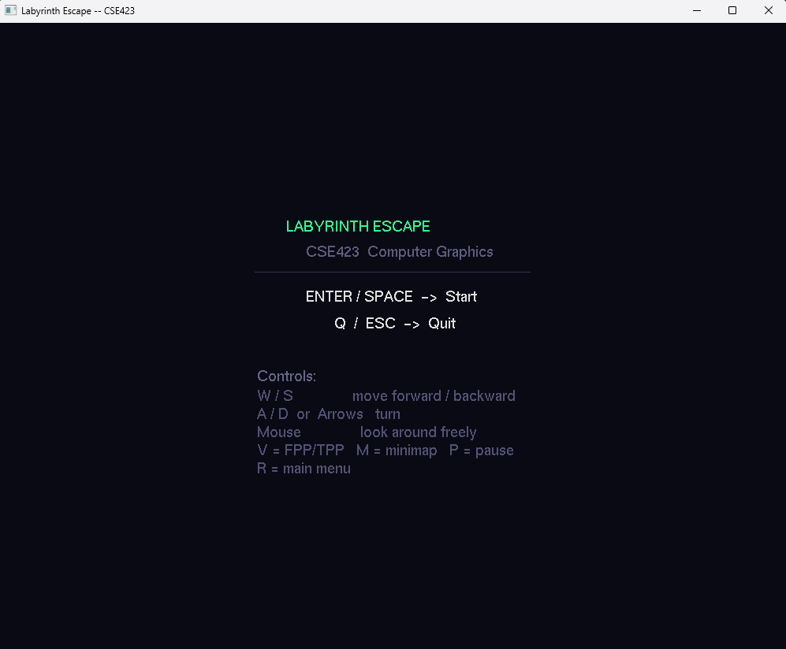
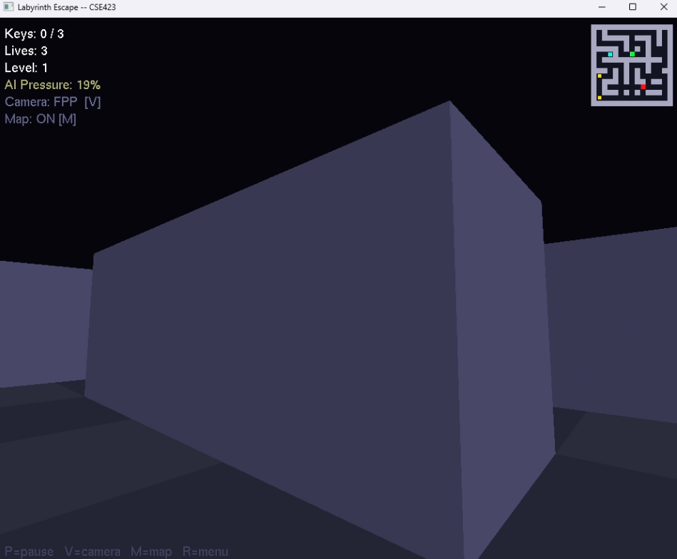
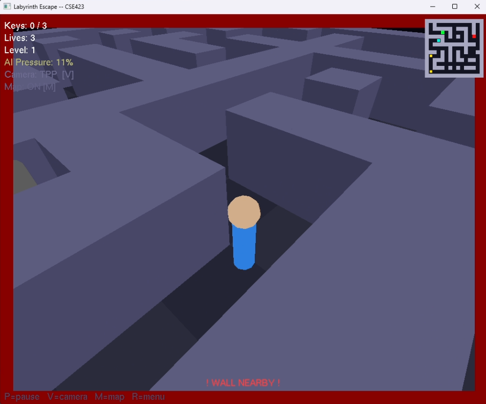
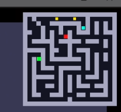
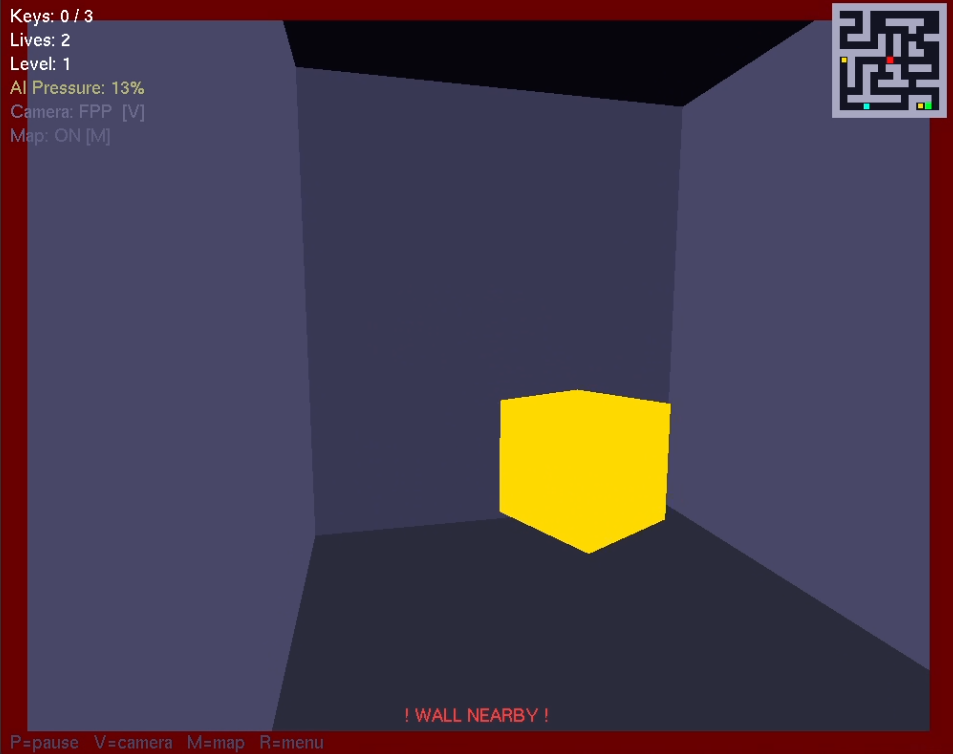
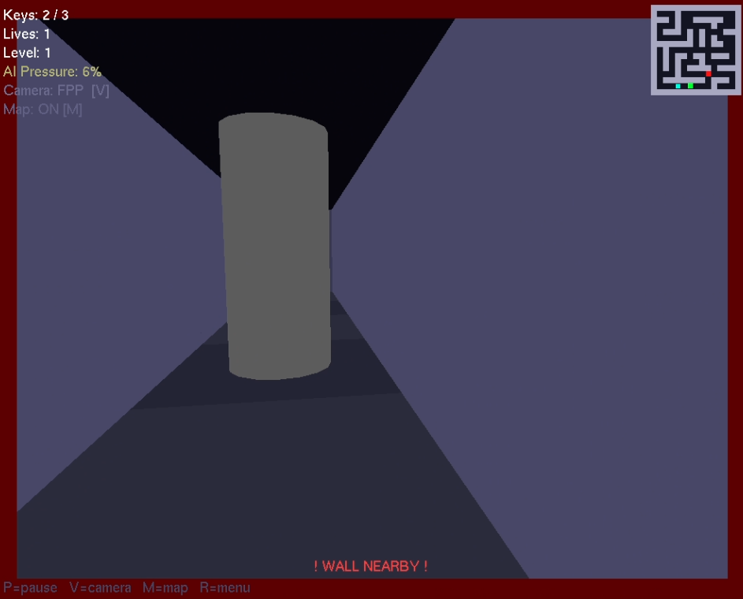
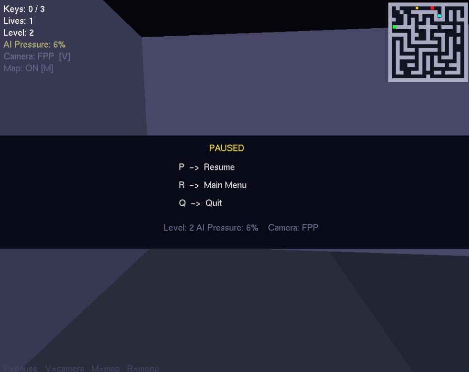
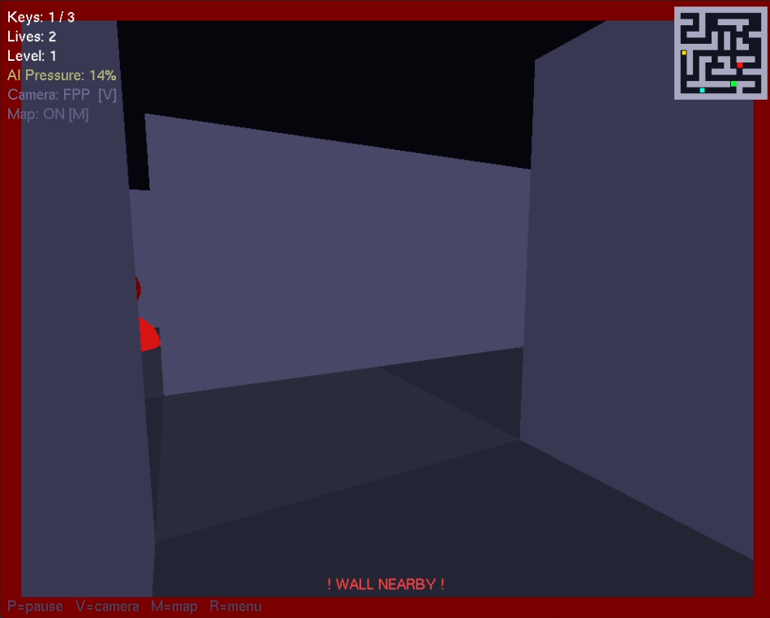

# Labyrinth Escape

> A 3D first-person maze game built **entirely** from scratch in PyOpenGL + GLUT — no game engine. Raw OpenGL calls, math only.

_CSE423 — Computer Graphics Lab · Term Project_

---



---

## What We Built

A fully playable 3D escape game where you collect 3 keys, unlock the exit, and outrun an enemy — across two procedurally generated levels that are **never the same twice**. Every system — maze generation, pathfinding, collision, adaptive AI, camera — is implemented from first principles inside the OpenGL/GLUT pipeline.

---

## Features

### Procedural Maze Generation

No hardcoded maps. Ever. The algorithm starts with a grid of all walls and a single open cell at `(1,1)`. From there, iterative DFS picks a random unvisited neighbour **two cells away**, carves through the wall between them, and pushes the new cell onto a stack. When it hits a dead end, it backtracks — this is what creates the winding, tree-like structure of a perfect maze where every cell is reachable and there are zero isolated pockets.

The catch with a pure DFS maze: it produces exactly one path between any two points, which makes navigation feel oppressive. So after generation, a second pass scans every interior wall that has at least two open neighbours and collects them as candidates. We then randomly open ~15% of those — just enough to create shortcut loops and alternate routes without collapsing the maze into open space. The result is structurally unique every run, always solvable, and actually fun to move through.

Level 2 uses a larger grid (`21×21` vs `15×15`) — same algorithm, meaningfully more complex output.

### Adaptive Difficulty AI

The enemy has a `pressureScore` — a float between `0.0` (easiest) and `1.0` (hardest) — that directly maps to two live game parameters:

```
enemyMoveSpeed = SPEED_MIN + pressureScore × (SPEED_MAX − SPEED_MIN)
enemyStepInterval = INTERVAL_MAX − pressureScore × (INTERVAL_MAX − INTERVAL_MIN)
```

Every 10 seconds, the engine re-evaluates three signals: **key collection rate** (keys per minute, normalised against a target of 3/min), **catch penalty** (each time the enemy catches you, it subtracts from performance), and **time pressure** (a slow-growing term that keeps the game from stalling if you stand idle). These combine into a raw performance score that the engine blends toward the current `pressureScore` at 35% per evaluation — so changes are gradual, not jarring.

If you're breezing through, pressure climbs and the enemy gets faster and smarter. If you keep getting caught, the engine immediately drops pressure by a fixed step and backs the enemy off. Your selected difficulty (Easy / Medium / Hard) only sets the **starting** pressure — from there, the AI takes over.

### BFS Enemy Pathfinding

The maze is a grid of cells. The enemy treats it as an **unweighted graph** — each open cell is a node, and edges connect cells that share a side with no wall between them. BFS explores this graph level by level from the enemy's current cell, using a queue: visit all neighbours at distance 1, then distance 2, and so on. The first time it reaches the player's cell, it has found the guaranteed shortest path — no heuristics, no approximation.

In practice, the enemy doesn't re-run BFS every single frame (that would be expensive on a 21×21 grid). Instead, it recalculates every `enemyStepInterval` milliseconds, stores the next cell in the path, then smoothly interpolates toward that cell's world-space centre using frame-accurate `dt` scaling:

```
step = min(distanceToTarget, enemyMoveSpeed × dt)
enemyPos += (direction / distance) × step
```

This means the enemy moves fluidly between cells rather than teleporting grid-to-grid, while its navigation decisions stay accurate to the actual maze topology. The BFS interval shrinks as pressure rises — on hard difficulty, the enemy is essentially re-routing in real time.

### Smooth Delta-Time Movement

Every movement value — player speed, turn rate, enemy speed — is multiplied by `dt` (seconds elapsed since the last frame). The consequence: the game is **frame-rate independent**. At 30fps `dt ≈ 0.033`, at 120fps `dt ≈ 0.008` — the product is the same distance per second either way.

On top of that, key state is tracked as boolean held/released flags updated by both `keyDown` and `keyUp` callbacks. The movement logic reads those flags every frame in `animate()` and applies the full `speed × dt` step continuously. This is what makes holding `W` feel smooth rather than producing the stutter you get when you naively move on each key-press event.

### FPP / TPP Camera with Mouse Look

- **FPP** — true first-person with full yaw + pitch mouse look
- **TPP** — third-person orbit camera that smoothly lerps behind the player via exponential interpolation
- Toggle with `V` mid-game. Mouse warps to center each frame for locked-cursor feel.

### 2D Mini-Map Overlay

A live bird's-eye HUD rendered in a **second `gluOrtho2D` pass** without disturbing the 3D scene. Shows walls, player (green), enemy (red), uncollected keys (yellow), and the exit (cyan).

### Boundary Warning

When the player gets close to a wall, red bars pulse around the screen edges — rendered as four `GL_QUADS` with a `sin`-based intensity oscillation.

### Everything Else

- Wall-slide collision (axis-separated AABB) — no getting cemented into corners
- Animated spinning keys (`glRotatef` + `glScalef` pulse)
- Glowing exit cylinder that activates when all keys are collected
- Lives system with respawn and catch cooldown
- Level transition screen with AI pressure carry-over
- Pause menu, minimap toggle, full main menu with controls reference

---

## Tech Stack

| What            | How                                |
| --------------- | ---------------------------------- |
| Language        | Python 3                           |
| Graphics        | PyOpenGL (`GL`, `GLUT`, `GLU`)     |
| 3D projection   | `gluPerspective` + `gluLookAt`     |
| 2D overlays     | `gluOrtho2D` second pass           |
| Pathfinding     | BFS (pure Python, no libraries)    |
| Maze generation | Iterative DFS + loop carvings      |
| Physics         | Manual AABB collision + axis slide |
| External libs   | **None** beyond PyOpenGL           |

---

## Screenshots

|                                               |                                                       |
| --------------------------------------------- | ----------------------------------------------------- |
|                  |          |
| _Main menu_                                   | _FPP — corridor navigation_                           |
|  |                    |
| _TPP — third-person orbit camera_             | _Live mini-map overlay_                               |
|      |        |
| _Collecting a glowing key_                    | _Exit unlocked — cyan pulse_                          |
|           |  |
| _Pause overlay with AI stats_                 | _Boundary warning — red edge flash_                   |

---

## Controls

| Key                    | Action                                    |
| ---------------------- | ----------------------------------------- |
| `W` / `S`              | Move forward / backward                   |
| `A` / `D` or `←` / `→` | Turn left / right                         |
| Mouse                  | Look around (FPP: yaw+pitch · TPP: orbit) |
| `V`                    | Toggle FPP / TPP camera                   |
| `M`                    | Toggle mini-map                           |
| `P`                    | Pause / resume                            |
| `R`                    | Back to main menu                         |
| `Q` / `ESC`            | Quit                                      |

---

## Run

```bash
pip install PyOpenGL PyOpenGL_accelerate
python labyrinth_escape.py
```

Tested on Windows and Linux with freeglut.

---

## License

This project is licensed under the MIT License — see the [LICENSE](https://github.com/777-flyer/computer-graphics-project/blob/main/LICENSE) file for details.

---

## Contributing

While this is primarily an educational and experimental repository, suggestions are welcome:

1. Fork the repository
2. Create a feature branch
3. Commit your changes
4. Push to the branch
5. Open a Pull Request

---

## Contact

For questions or discussions about the implementations:

- Create an issue in this repository
- Connect via [LinkedIn](https://www.linkedin.com/in/ahnaf-rahman-brinto)

---

## Acknowledgments

- **Institution:** BRAC University
- **Course:** CSE423 — Computer Graphics Lab
- **Semester:** Spring 2026

---

## Academic Integrity

This repository is shared publicly for learning and reference purposes. While you're welcome to study the implementations and understand the concepts, please do not copy code directly for your coursework or assignments.

Academic integrity matters. Use this as a learning resource to build your own understanding, not as a shortcut. Your future self (and your professor) will thank you.

> **Note:** This repository represents coursework/project completed in Spring 2026. Problem statements are proprietary to BRAC University and are not included to respect copyright.

Happy Learning!
